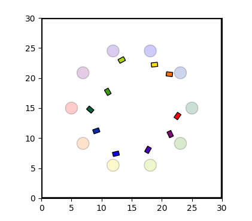

## Navigation Gym
This is an multi-robot navigation package for reinforcement learning. The package enables Ackermann-steering, differential-drive and both rectangular and round-shaped robot models for accurate kinematic performance.
The 2D lidar is available for state representions and collision detections. DIY environments wrapped in OpenAI Gym framework supports the fast setting-up. DDPG, SAC, MADDPG, QMix, VDN algorithms has been implemented in the package.

 

